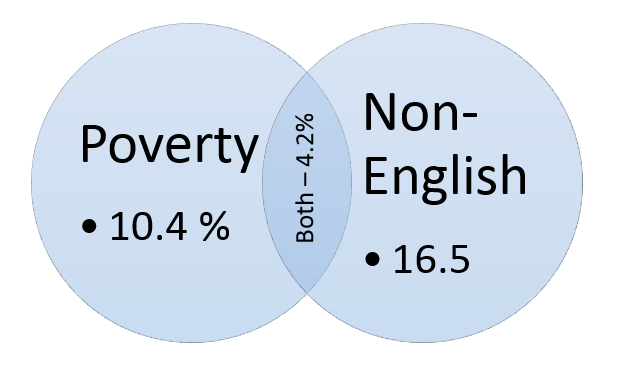

***
2.6

a. 0, the lowest sum is 2

b. `r 4/36`

c. `r 1/36`

2.8

a. The events can occur at the same time, so they are not disjoint.

b. 

c. 10.4%

d. 26.9%

e. 89.6%

f. `r .207 * .146` does not equal .042, so they are dependent.

2.20

a. (114 + 108 - 78) / 204 = `r (114 + 108 - 78) / 204`

b. 78 / 114 = `r 78 / 114`

c. brown male x blue female: 19 / 54 = `r 19 / 54`, green male x blue female: 11 / 36 = `r 11 / 36`

d. P(Fb|Mb) = 78 / 114 = `r 78 / 114`, while P(Fb) = 108 / 204 = `r 108 / 204`, so the events are not independent, and eye color affects partner eye color.

2.30

a. (28/95) * (59/94) = `r (28/95) * (59/94)`

b. .22((72/95) * (28/94)) + .88((72/95) * (27/94)) = `r .22 * ((72/95) * (28/94)) + .88 * ((72/95) * (27/94))`

c. (72/95) * (28/95) = `r (72/95) * (28/95)`

d. If the sample size is large enough that losing 1 book doesn't largely change the probabilities.

2.38

a.
```{r}
zero <- 0 * .54
one <- 25 * .34
two <- 60 * .12
expected <- zero + one + two
expected

z1 <- ((zero - expected) ^ 2) * .54
o1 <- ((one - expected) ^ 2) * .34
t1 <- ((two - expected) ^ 2) * .12
var <- z1 + o1 + t1
var

sd <- sqrt(var)
sd
```

b.
```{r}
zero <- 0 * .54 * 120
one <- 25 * .34 * 120
two <- 60 * .12 * 120
expected <- zero + one + two
expected

z1 <- ((zero - expected) ^ 2) * .54
o1 <- ((one - expected) ^ 2) * .34
t1 <- ((two - expected) ^ 2) * .12
var <- z1 + o1 + t1
var

sd <- sqrt(var)
sd
```

2.44

a. it is slightly skewed to the right

b. `r 2.2 + 4.7 + 15.8 + 18.3 + 21.2`

c. assuming that everyone in the sample works, `r (.41 * (2.2 + 4.7 + 15.8 + 18.3 + 21.2)) / 100`

d. `r .41 * .718`, I think this value is reasonable, if some females do not work, the percentage that make under 50k a year would be higher, and this reflects that.